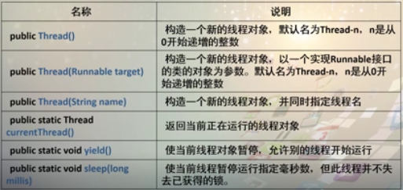

# 线程
> 通过java.lang.Thread实现

## 线程与进程区别
* 进程相当于每一个应用程序
* 线程相当于每一个应用程序中同时运行的方法

## 构造线程的方法
* 定义一个线程类，继承Thread并重写run(),调用时使用start()
* 实现接口Runnable,实例化Thread对象时将接口的实现类放入，调用start()

## 两种方法对比
> 使用Thread实现,实现简单
> 使用接口方式实现,可以将CPU与代码分开,并且由于Java是单继承,方便开发

## 线程休眠
> 线程休眠使得其他线程可以执行,方法为Thread.sleep();

## Thread类

## 线程内部的数据共享
> 使用接口方式实现多线程,多个线程共享同一对象中的数据