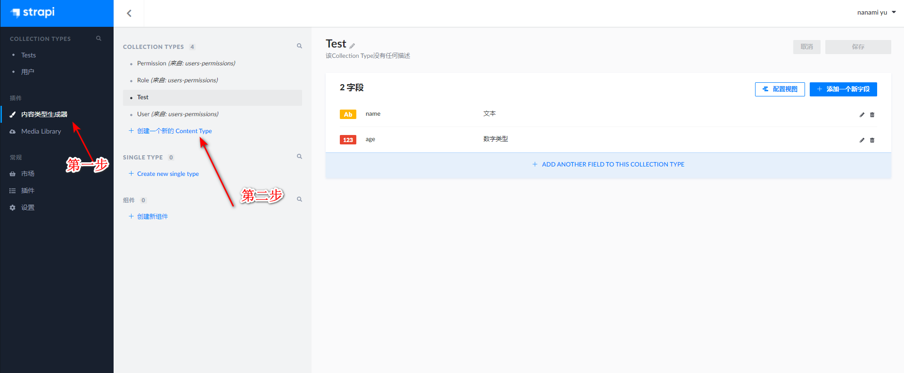
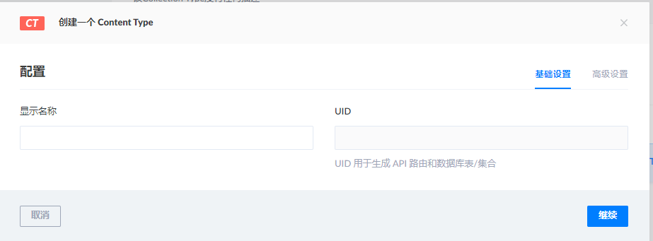
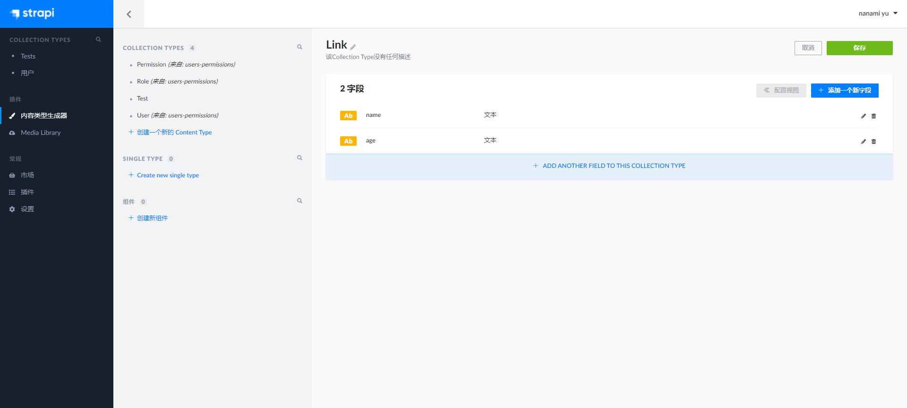
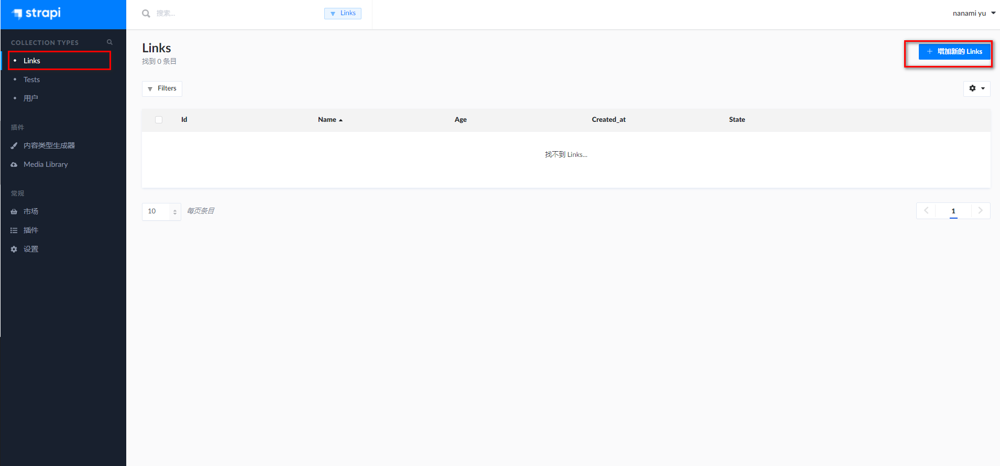
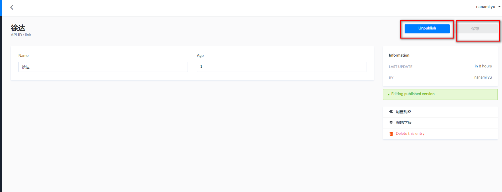
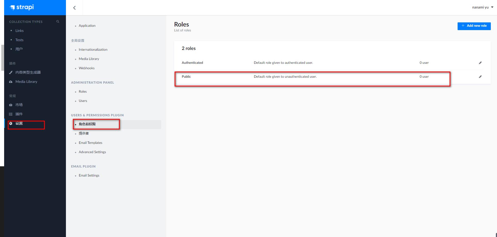
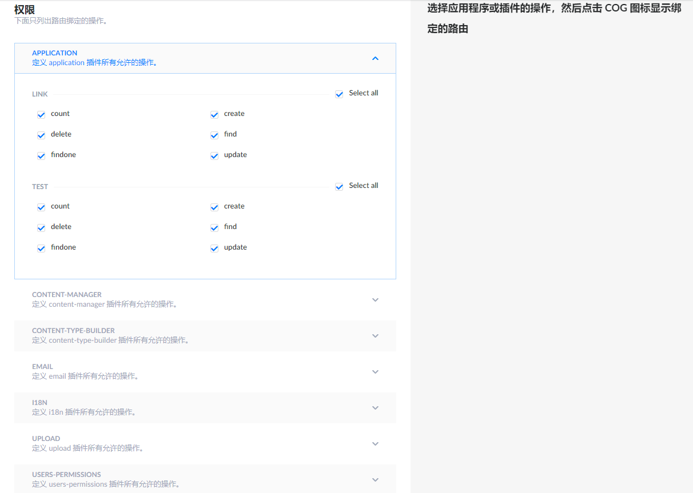
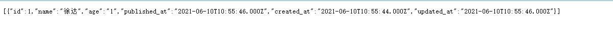

# Strapi
> strapi 是一个先进的 Node.js 内容管理框架（headless-CMS），可以毫不费力地构建强大的 API

## 安装
### windows
> 参考地址 https://github.com/AutumnFish/strapi_study
```sh
npm install strapi -g
npx create-strapi-app test1
cd test1
npm install
npm run develop
```

### docker
```sh
docker pull strapi/strapi
# link到mysql数据库 并且需要创建持久化
docker run -d \
  --link=mysql \
  --name strapi \
  -e DATABASE_CLIENT=mysql \
  -e DATABASE_NAME=strapi_info \
  -e DATABASE_HOST=mysql \
  -e DATABASE_PORT=3306 \
  -e DATABASE_USERNAME=root \
  -e DATABASE_PASSWORD=123456 \
  -p 1337:1337 \
  -v /usr/local/strapi-docker/nanami:/srv/app \
  strapi/strapi
```

### 访问地址
http://192.168.1.162:1337

<em>1@qq.com/1qaz@WSX</em>

## 操作
> [中文文档](https://getstrapi.cn/)
>
> [简单操作](https://www.cnblogs.com/Frank-yafeya/p/14792567.html)

### 添加一个表



此时可以根据需要添加字段,本次添加文本


点击右上角保存等待重启后即可在左侧菜单看见添加的表



选择刚才添加的表,添加数据



点击保存后,可以选择是否发布,发布的数据通过接口可以查询到



此时通过接口是无法访问数据的,需要开放权限

### 开放权限


点击修改按钮,选择想要开放的权限



> 192.168.2.162:1337/Links



## 访问方式
> 以一个名为links的表举例,需要注意更新时不会更新未传递的选项,如果要清空请设置为null

<center>

| 请求方式 | 路径  | 描述 |
| :-: | :-: | :-: |
| GET | /links | 获取一个links的list |
| GET | /links/1  | 获取links中id为1的值 |
| GET | /links/count  | 获取links总数 |
| POST | /links  | 创建一个links对象 |
| DELETE | /links/1  | 删除links中id为1的值 |
| PUT | /links/1  | 更新links中id为1的值 |

</center>

## 过滤器

| 请求方式 | 路径  |
| :-: | :-: |
| eq | 相等 |
| eq | 不相等 |
| lt | 少于 |
| gt | 大于|
| lte | 小于等于|
| gte |   大于等于|
| in | 包含在数组中 |
| nin | 不包含在数组中 |
| contains | 包含 |
| ncontains | 不包含 |
| containss | 包含,区分大小写  |
| ncontainss | 不包含,区分大小写|
| null |  为空或不为空 |

### 例子
* 查找name

GET /links?name=John or GET /links?name_eq=John

* 查找age大于3

GET /links?age_gte=3

* 查找id为3、6、8的数据

GET /links?id_in=3&id_in=6&id_in=8

* 使用_where

GET /links?_where[age]=3

GET /links?_where[0][age_gte]=3&[0][age_lte]=7

## 复杂过滤器
> 建议使用qs生成查询

```sh
npm install qs -g -s
import qs from 'qs’
```
* qs.parse()是将URL解析成对象的形式
* qs.stringify()是将对象 序列化成URL的形式，以&进行拼接

### and
查询名字为徐达,num小于等于2的值
```js
const query = qs.stringify({
  _where: [{ name: "徐达" }, { num_lte: 2 }],
});

await request(`/links?${query}`);
// GET /restaurants?_where[0][stars]=1&_where[1][pricing_lte]=20
```

### or
查询名字为徐达或者num等于1的值
```js
const query = qs.stringify({
    _where: { _or: [{ name: "徐达" }, { num: 1 }] }
});

await request(`/links?${query}`);
// GET /restaurants?_where[_or][0][name]=徐达&_where[_or][1][num]=1
```
> 当传递数组时会默认转换为or(in nin除外)

查询名字为徐达或者李鸾
```js
const query = qs.stringify({
  _where: [{ name: ["徐达","李鸾"] }],
});

await request(`/links?${query}`);
// GET /restaurants?_where[name][0]=徐达&_where[name][1]=李鸾
```
### 深度过滤
类似test-for-links?test.name=1 可以把关联的数据字段进行查询

### 排序
Get links?_sort=name:ASC,num:desc

### 限制数量
Get links?_limit=30
> 默认值为100,当需要所有数据值请传-1

### 分页
Get links?_start=10&_limit=10

